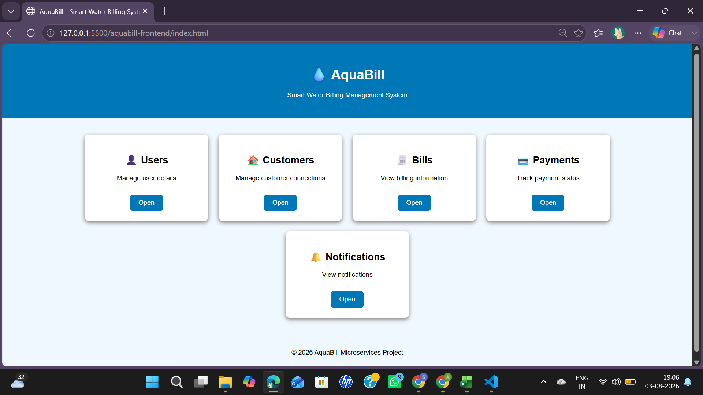
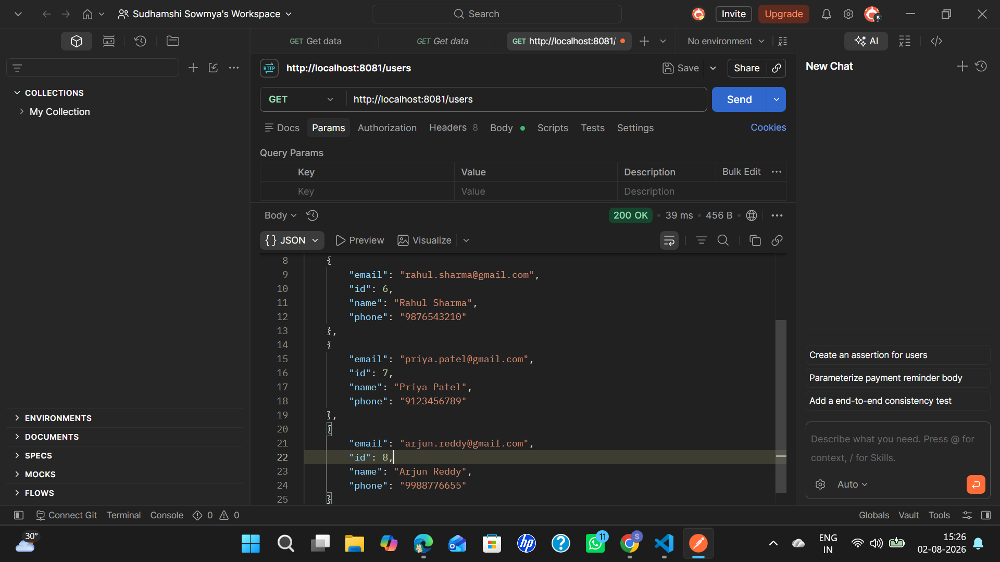
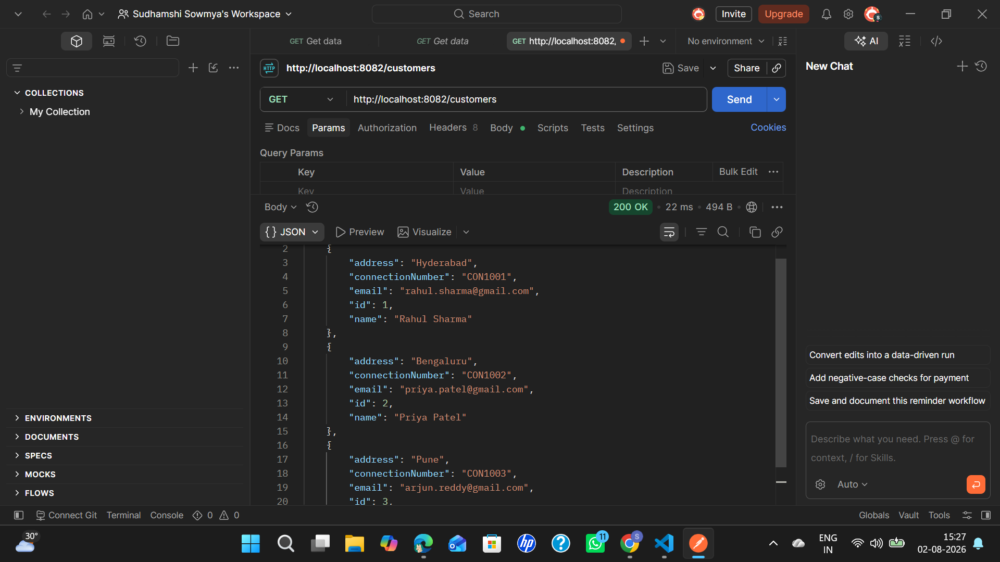
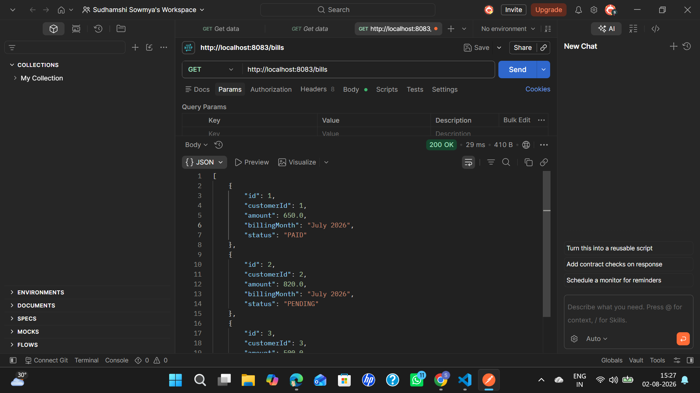
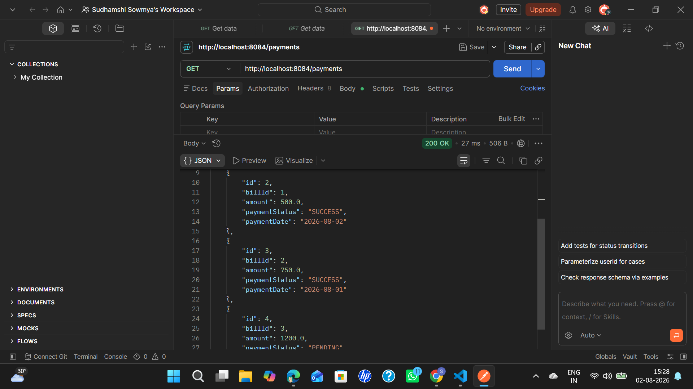
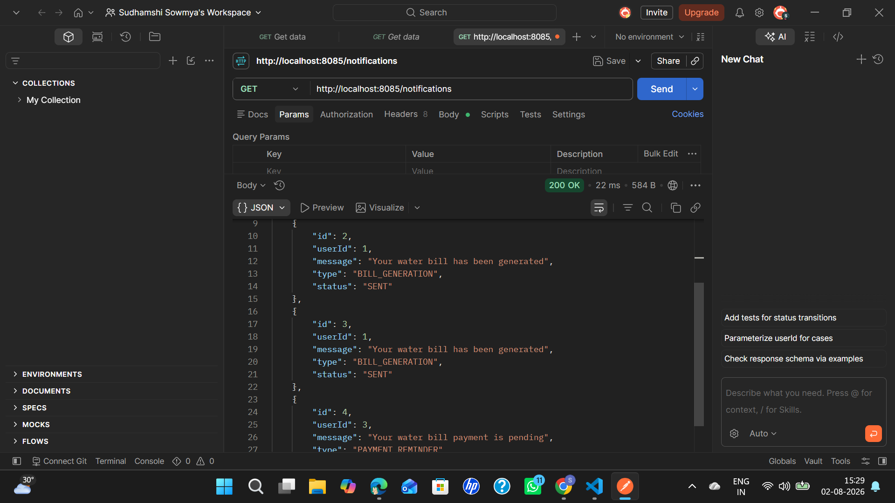
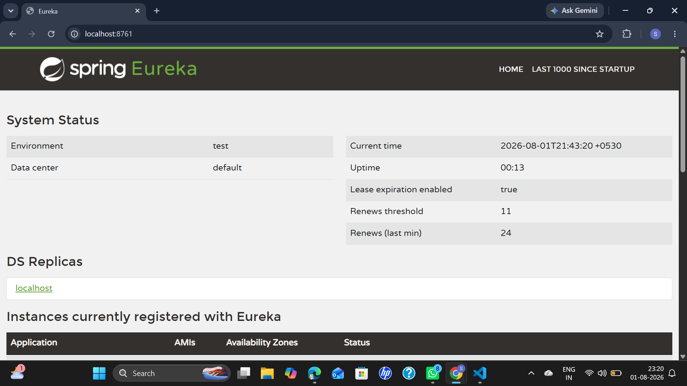
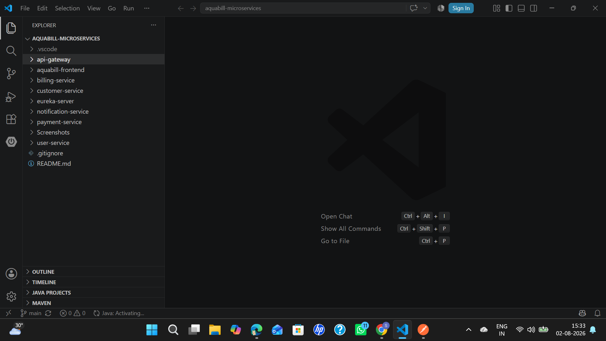

# AquaBill - Smart Water Billing Management System

## Overview

AquaBill is a Smart Water Billing Management System developed using Spring Boot Microservices Architecture. The application manages users, customers, billing, payments, and notifications through independent microservices. It leverages Spring Cloud Gateway for request routing and Eureka Server for service discovery, providing a scalable and maintainable architecture.

---

## Features

- User Management
- Customer Management
- Billing Management
- Payment Management
- Notification Management
- API Gateway
- Service Discovery using Eureka Server
- MySQL Database Integration
- Responsive Frontend

---

## Project Workflow

1. User accesses the application through the frontend.
2. API Gateway receives and routes the request.
3. Eureka Server identifies the required microservice.
4. The selected microservice processes the request.
5. Data is stored or retrieved from the MySQL database.
6. The response is returned to the frontend.

## Technology Stack

### Backend
- Java 17
- Spring Boot
- Spring Data JPA
- Spring Cloud
- Spring Cloud Gateway
- Eureka Server
- Maven

### Frontend
- HTML
- CSS
- JavaScript

### Database
- MySQL

### Development Tools
- Visual Studio Code
- Postman
- Git
- GitHub

---

## Microservices

- Eureka Server
- API Gateway
- User Service
- Customer Service
- Billing Service
- Payment Service
- Notification Service

---

## Project Structure

```text
AquaBill-Microservices
│
├── api-gateway
├── aquabill-frontend
├── billing-service
├── customer-service
├── eureka-server
├── notification-service
├── payment-service
├── user-service
├── Screenshots
└── README.md
```

---

## System Architecture

```text
                  Frontend
                      │
                      ▼
                API Gateway
                      │
                      ▼
               Eureka Server
                      │
      ┌──────────────────────────────┐
      │        Microservices         │
      │                              │
      │  User Service                │
      │  Customer Service            │
      │  Billing Service             │
      │  Payment Service             │
      │  Notification Service        │
      └──────────────────────────────┘
                      │
                      ▼
               MySQL Database
```

---

## API Endpoints

| Service | Endpoint |
|----------|----------|
| User Service | `http://localhost:8081/users` |
| Customer Service | `http://localhost:8082/customers` |
| Billing Service | `http://localhost:8083/bills` |
| Payment Service | `http://localhost:8084/payments` |
| Notification Service | `http://localhost:8085/notifications` |

---

## Project Screenshots

### Home Page



---

### User Service



---

### Customer Service



---

### Billing Service



---

### Payment Service



---

### Notification Service



---

### Eureka Dashboard



---

### Project Structure



---

## Getting Started

### Prerequisites

- Java 17
- Maven
- MySQL
- Git
- Visual Studio Code

### Installation

1. Clone the repository.

```bash
git clone https://github.com/<your-username>/AquaBill-Microservices.git
```

2. Open the project in Visual Studio Code.

3. Configure the MySQL database in each microservice's `application.properties` file.

4. Start the Eureka Server.

5. Start the API Gateway.

6. Run all the microservices.

7. Launch the frontend using Live Server.

---

## Developer

**Sudhamshi Sowmya Kongari**

Bachelor of Technology  
Computer Science and Engineering (Artificial Intelligence and Machine Learning)  
Parul University

---

## License

This project was developed for academic learning and internship purposes.